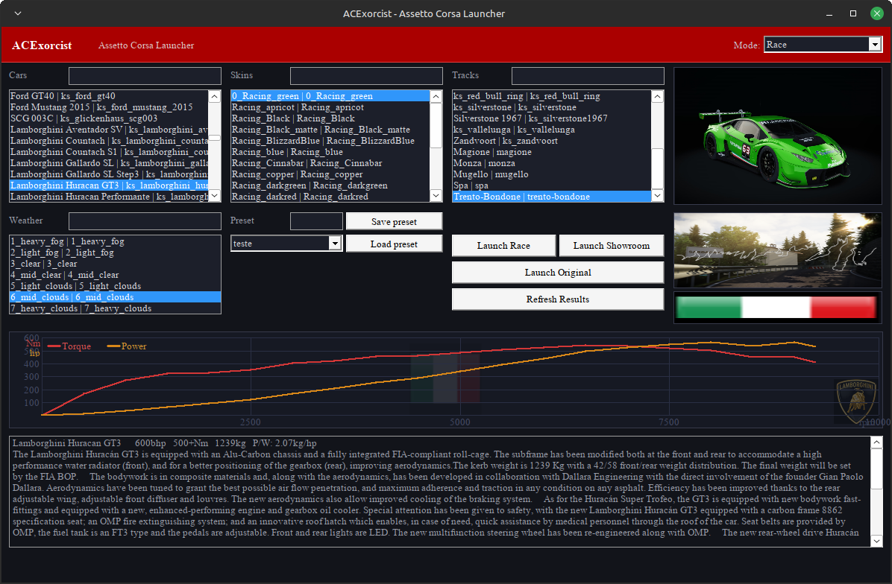

# ACExorcist

A tiny experimental launcher replacement for **Assetto Corsa**.



I made this because I wanted to test a steering wheel on Linux/Proton, but the original Assetto Corsa launcher can fail before the actual simulator starts. The simulator itself can often run fine; the fragile part is the launcher stack around it.

The original launcher is `AssettoCorsa.exe` — a .NET + CEF (Chromium Embedded Framework) application. That is a lot of infrastructure for something that ultimately writes a few INI files and calls `CreateProcess`. On Wine/Proton that stack has extra failure modes.

ACExorcist is intentionally small: it reads Assetto Corsa content folders, lets you pick a car, skin, track/layout and weather, writes the minimum INI state, and launches the real game executable.

No .NET. No CEF. No Chromium. No embedded web UI.

## Status

**Experimental / personal testing project.**

This is not a full Content Manager replacement and it is not intended to manage a complete Assetto Corsa modding setup. It exists mainly to launch the game with a simple local configuration.

## What it does

- Scans `content/cars`.
- Reads car metadata from `ui/ui_car.json`.
- Scans car skins from `skins/`.
- Scans `content/tracks`.
- Reads track metadata from `ui/ui_track.json`.
- Detects track layouts from subfolders inside `content/tracks/<track>/ui/`.
- Scans `content/weather`.
- Shows simple car/track/flag previews when available.
- Writes selected race state to `cfg/race.ini`.
- Writes showroom state to `cfg/showroom_start.ini`.
- Creates `steam_appid.txt` with `244210` when missing.
- Launches:
  - `acs.exe` for races
  - `acShowroom.exe` for showroom
  - `AssettoCorsa_original.exe` for the original launcher, if preserved
- Saves last selected state and presets in `ACExorcist.ini`.
- Logs basic activity to `ACExorcist.log`.
- Displays basic information from `race_out.json` or `laps.ini` when available.

## What it does not do

- It does not replace Content Manager.
- It does not install Proton, Proton-GE, DXVK, CSP, fonts, .NET, or any redistributables.
- It does not configure steering wheels, pedals, FFB, Steam Input, or controller bindings.
- It does not manage online servers.
- It does not manage mods.
- It does not configure Custom Shaders Patch.
- It does not create a complete race/session model.
- It currently launches a simple one-car setup by setting `RACE.CARS=1`.

## How it works

Assetto Corsa's actual simulator executable is `acs.exe`. The launcher prepares INI files and then starts the simulator.

ACExorcist follows that same idea:

```text
ACExorcist / AssettoCorsa.exe
  -> scan content/
  -> update cfg/race.ini or cfg/showroom_start.ini
  -> CreateProcessW("acs.exe") or CreateProcessW("acShowroom.exe")
```

The program detects the Assetto Corsa directory from its own executable path, so it is meant to live inside the Assetto Corsa installation folder.

## Installation

Back up the original launcher first.

Inside your Assetto Corsa folder:

```text
AssettoCorsa.exe
acs.exe
acShowroom.exe
content/
cfg/
```

Rename the original launcher:

```bash
mv AssettoCorsa.exe AssettoCorsa_original.exe
```

Copy the compiled ACExorcist executable into the same folder and rename it to:

```text
AssettoCorsa.exe
```

The resulting layout should look like:

```text
AssettoCorsa.exe           <- ACExorcist
AssettoCorsa_original.exe  <- original launcher backup
acs.exe                    <- actual simulator
acShowroom.exe             <- showroom executable
```

Then launch Assetto Corsa from Steam normally.

## Building

The project is a native Win32 C++ application.

### Dependencies

- C++20 compiler targeting Windows
- WinAPI
- Common Controls (`comctl32`)
- GDI+ (`gdiplus`)
- [`nlohmann/json.hpp`](https://github.com/nlohmann/json)

Place `nlohmann/json.hpp` where your compiler can find it, for example:

```text
nlohmann/json.hpp
main.cpp
```

### MinGW-w64 example

```bash
x86_64-w64-mingw32-g++-posix main.cpp \
  -O2 -std=c++20 -DUNICODE=1 -municode -mwindows \
  -I. \
  -o ACExorcist.exe \
  -lgdi32 -lgdiplus -lcomctl32 \
  -static
```

The `-static` flag produces a fully self-contained executable with no external DLL dependencies on the MinGW runtime, which is required for the binary to run under Wine/Proton.

Then copy/rename:

```bash
cp ACExorcist.exe /path/to/steamapps/common/assettocorsa/AssettoCorsa.exe
```

### MSVC example

```bat
cl /std:c++20 /EHsc /DUNICODE /D_UNICODE main.cpp ^
  /Fe:ACExorcist.exe ^
  gdi32.lib gdiplus.lib comctl32.lib
```

## Files touched by ACExorcist

ACExorcist may create or modify these files in the Assetto Corsa folder:

```text
steam_appid.txt
ACExorcist.ini
ACExorcist.log
cfg/race.ini
cfg/showroom_start.ini
```

It reads from:

```text
content/cars/
content/tracks/
content/weather/
content/gui/NationFlags/
race_out.json
laps.ini
```

## Safety notes

Before using this, back up:

```text
AssettoCorsa.exe
cfg/race.ini
cfg/showroom_start.ini
```

Steam's "Verify integrity of game files" may restore the original `AssettoCorsa.exe`, replacing this launcher.

Game updates may also overwrite files in the installation directory.

## Disclaimer

This is a personal experimental project made for testing and troubleshooting. It was developed with AI assistance and has not been fully tested.

Use it at your own risk.

This project may modify Assetto Corsa configuration files and replace the original launcher executable if installed as `AssettoCorsa.exe`. Always keep backups of the original files.

This project is not affiliated with, endorsed by, or supported by Kunos Simulazioni, 505 Games, Valve, Steam, Proton, or the authors of Content Manager / Custom Shaders Patch.

No warranty is provided. It may fail to launch the game, generate invalid configuration files, break existing race settings, or behave differently across Windows, Wine, Proton versions, filesystems, and modded installations.

Review the code before running it.

## License

This project is licensed under the **MIT License** — see the [LICENSE](LICENSE) file for details.
